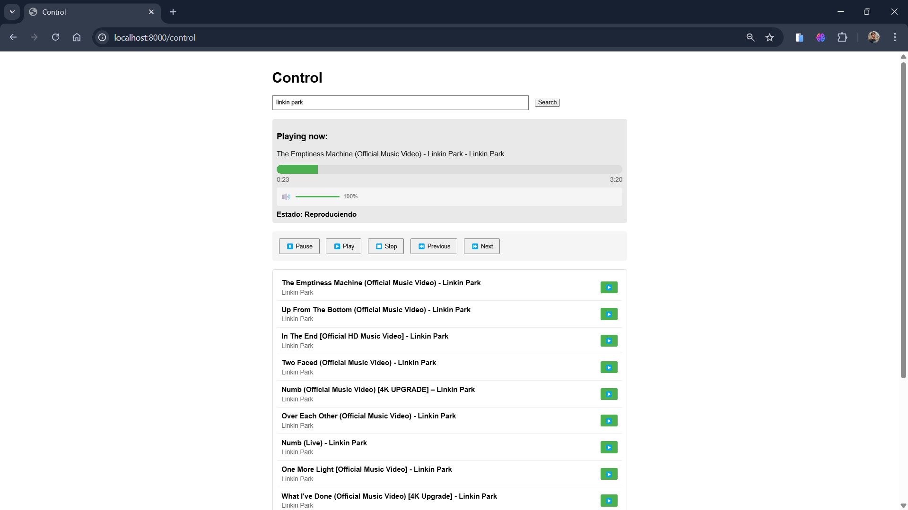
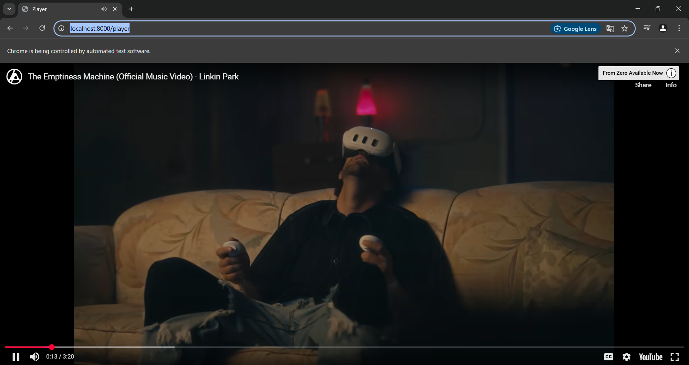
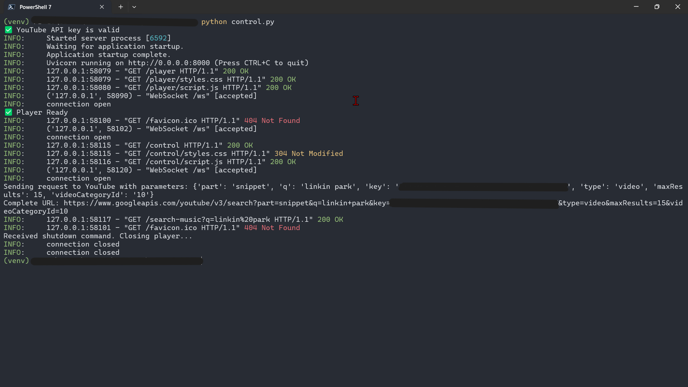

# S.Y.C 
*(SDK_YOUTUBE_CONTROL)*

S.Y.C es un proyecto **Open Source** con licencia **MIT** diseñado para desarrolladores que necesitan **integrar y controlar la API de YouTube** en sus aplicaciones. 
Proporciona una interfaz programática robusta para **gestionar streams de contenido multimedia** mediante WebSockets, permitiendo implementaciones headless y automatizadas sin depender de la interfaz gráfica del navegador. Ideal para proyectos que requieren manipulación programática de contenido de YouTube con mínima sobrecarga de recursos.

[English] S.Y.C is an **Open Source** project with **MIT** license designed for developers who need to **integrate and control the YouTube API** in their applications.
It provides a robust programmatic interface for **managing multimedia content streams** through WebSockets, enabling headless and automated implementations without depending on the browser's graphical interface. Ideal for projects that require programmatic manipulation of YouTube content with minimal resource overhead.

## ¿Qué es S.Y.C y para qué sirve? | What is S.Y.C and what is it for?

S.Y.C ofrece las siguientes funcionalidades clave para **controlar y gestionar** contenido de YouTube:

[English] S.Y.C offers the following key features to **control and manage** YouTube content:

- **Integración con API de YouTube**:  
  Proporciona una interfaz programática para buscar y reproducir videos de YouTube sin depender de la interfaz gráfica del navegador.

[English] - **YouTube API Integration**:  
  Provides a programmatic interface to search and play YouTube videos without depending on the browser's graphical interface.

- **Comunicación por WebSockets**:  
  Establece un canal de comunicación bidireccional entre el servidor y el reproductor para control en tiempo real.

[English] - **WebSocket Communication**:  
  Establishes a bidirectional communication channel between the server and player for real-time control.

- **Gestión de listas de reproducción**:  
  Permite crear y administrar listas de reproducción con videos de YouTube de forma programática.

[English] - **Playlist Management**:  
  Allows creating and managing playlists with YouTube videos programmatically.

- **Control automatizado**:  
  Facilita la automatización de tareas como reproducción, pausa, cambio de videos y gestión del volumen.

[English] - **Automated Control**:  
  Facilitates automation of tasks such as play, pause, video switching, and volume management.

- **Implementación headless**:  
  Posibilita la ejecución en segundo plano sin necesidad de interacción manual, ideal para aplicaciones de servidor.

[English] - **Headless Implementation**:  
  Enables background execution without manual interaction, ideal for server applications.

### Requisitos Previos (Desarrollo) | Prerequisites (Development)

- **Sistema operativo**: Linux/Windows o MacOS.  
- **Python**: Versión 3.7 o superior.  
- **Dependencias**: Listadas en `requirements.txt`.  

[English] - **Operating System**: Linux/Windows or MacOS.  
- **Python**: Version 3.7 or higher.  
- **Dependencies**: Listed in `requirements.txt`.  

### Uso Básico | Basic Usage

1. **Iniciar el servidor**:  
   ```bash
   python control.py
   ```
   Inicia el servidor FastAPI que gestiona la comunicación entre la interfaz de control y el reproductor.

[English] 1. **Start the server**:  
   ```bash
   python control.py
   ```
   Starts the FastAPI server that manages communication between the control interface and player.

2. **Acceder a la interfaz de control**:  
   Abre en tu navegador:
   ```
   http://localhost:8000/control
   ```
   Desde aquí podrás buscar videos, crear listas de reproducción y controlar la reproducción.

[English] 2. **Access the control interface**:  
   Open in your browser:
   ```
   http://localhost:8000/control
   ```
   From here you can search for videos, create playlists and control playback.

3. **Buscar contenido**:  
   Utiliza la barra de búsqueda para encontrar videos de YouTube usando la API oficial.

[English] 3. **Search content**:  
   Use the search bar to find YouTube videos using the official API.

4. **Gestionar la reproducción**:
   - Reproducir/Pausar videos
   - Ajustar volumen
   - Controlar el Timeline
   - Saltar al siguiente/anterior video
   - Crear y gestionar listas de reproducción

[English] 4. **Manage playback**:
   - Play/Pause videos
   - Adjust volume
   - Control Timeline
   - Skip to next/previous video
   - Create and manage playlists

5. **Detener el servidor**:  
   ```bash
   powershell -ExecutionPolicy Bypass -File shutdown.ps1
   ```
   Envía una señal de apagado controlado al servidor y cierra el reproductor.

[English] 5. **Stop the server**:  
   ```bash
   powershell -ExecutionPolicy Bypass -File shutdown.ps1
   ```
   Sends a controlled shutdown signal to the server and closes the player.

7. **Configuración de la API**:  
   Para usar tu propia clave de API de YouTube, modifica la variable `YOUTUBE_API_KEY` en el archivo `control.py`.

[English] 7. **API Configuration**:  
   To use your own YouTube API key, modify the `YOUTUBE_API_KEY` variable in the `control.py` file.

8. **Personalización**:  
   Puedes modificar los archivos HTML, CSS y JavaScript en las carpetas `control` y `player` para adaptar la interfaz a tus necesidades.

[English] 8. **Customization**:  
   You can modify the HTML, CSS and JavaScript files in the `control` and `player` folders to adapt the interface to your needs.

## Ejemplos de uso | Usage Examples

- **Reproducción automática de música**:  
  Inicia el servidor con `python control.py` y accede a la interfaz de control para buscar y reproducir música sin interrupciones.
  
[English] - **Automatic music playback**:  
  Start the server with `python control.py` and access the control interface to search and play music without interruptions.
  
- **Control remoto desde otro dispositivo**:  
  Útil si quieres controlar la reproducción desde un dispositivo móvil u otro ordenador.  
  ```bash
  # En el dispositivo de control, accede a:
  http://[IP-del-servidor]:8000/control
  ```

[English] - **Remote control from another device**:  
  Useful if you want to control playback from a mobile device or another computer.  
  ```bash
  # On the control device, access:
  http://[server-IP]:8000/control
  ```

## Contribuciones al Proyecto | Project Contributions

S.Y.C (SDK_YOUTUBE_CONTROL) es **código abierto**. ¡Todas las contribuciones son bienvenidas!  
Para colaborar:

[English] S.Y.C (SDK_YOUTUBE_CONTROL) is **open source**. All contributions are welcome!  
To collaborate:

1. Haz un **fork** del repositorio.
2. Crea una rama para tu funcionalidad:
   ```bash
   git checkout -b feature/mi-nueva-feature
   ```
3. Realiza los cambios y confirma el commit:
   ```bash
   git commit -m "Mi nueva característica en SDK_YOUTUBE_CONTROL"
   ```
4. Sube los cambios a tu rama:
   ```bash
   git push origin feature/mi-nueva-feature
   ```
5. Abre un **Pull Request** en el repositorio original.

[English] 1. Make a **fork** of the repository.
2. Create a branch for your feature:
   ```bash
   git checkout -b feature/my-new-feature
   ```
3. Make changes and commit:
   ```bash
   git commit -m "My new feature in SDK_YOUTUBE_CONTROL"
   ```
4. Push changes to your branch:
   ```bash
   git push origin feature/my-new-feature
   ```
5. Open a **Pull Request** in the original repository.

## Contacto | Contact

Este proyecto fue desarrollado por [Devnis](https://github.com/DevnisG).  
Si tienes **preguntas**, **sugerencias** o **comentarios**, no dudes en abrir un **Issue** o contactarme vía:

[English] This project was developed by [Devnis](https://github.com/DevnisG).  
If you have **questions**, **suggestions** or **comments**, don't hesitate to open an **Issue** or contact me via:

- **Correo electrónico**: <denis.gontero.2000@gmail.com>  
- **Discord**: *Devnis*  

[English] - **Email**: <denis.gontero.2000@gmail.com>  
- **Discord**: *Devnis*  

## Licencia | License

S.Y.C se distribuye bajo la **licencia MIT**. Consulta el archivo [LICENSE](LICENSE) para más detalles.  

[English] S.Y.C is distributed under the **MIT license**. Check the [LICENSE](LICENSE) file for more details.  

¡Gracias por usar S.Y.C! Espero que te ayude a integrar y controlar la API de YouTube en tus aplicaciones de manera eficiente.

[English] Thank you for using S.Y.C! I hope it helps you integrate and control the YouTube API in your applications efficiently.

## Vista Previa | Preview

**Control**
 

**Player**
 

**Console**
 